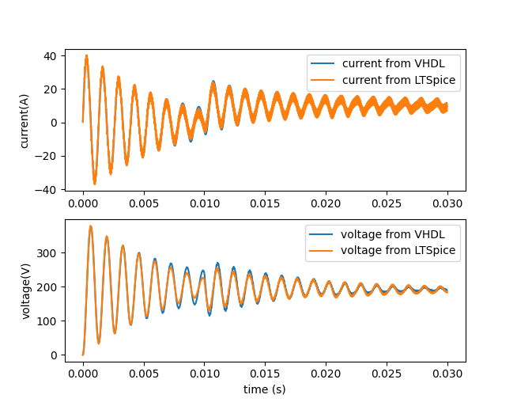

# VHDL library for synthesizable real-time simulation tools of dynamic systems.
Library is based on state-variable type that has integration method for simulating differential equations in real time on FPGA. Different applications include LCR filters and power electronics converters

All of the testbenches can be run using VUnit with GHDL and the associated python script
> python vunit_run_dynamic_simulation_library.py -p 24 --gtkwave-fmt ghw

There are also a few LTSpice simulation models that the simulations done in VHDL can be compared against. This can be done by first runnign all testbenches, then running the LTSPice simulation and lastly plotting the results by running the appropriate python script.

Here is an example of a buck converter model that can be found in testbenches/buck/buck_with_input_and_output_filters_tb.vhd and the corresponding LTSPice simulation can be found at ltpice_circuits/buck_converter/synch_buck_w_input_filter.asc

First run all testbenches with vunit script, then run the synch_bu_w_input_filter.asc with LTSpice and lastly run the plot_buck_data.py

  </a>

Note that to run PYLTspice, you need to set the tool location in the plot_buck_data.py file

There are also blog posts explaining the design of the state variable and the dynamic simulation models

state variable module design :

https://hardwaredescriptions.com/real-time-dynamic-simulation-with-fpga-vol-1-the-space-of-states/

power supply simulation : 

https://hardwaredescriptions.com/real-time-dynamic-simulation-with-fpga-vol-2-differential-equations-on-a-chip/

permanent magnet motor modeling and control

https://hardwaredescriptions.com/field-oriented-motor-control-with-vhdl/
